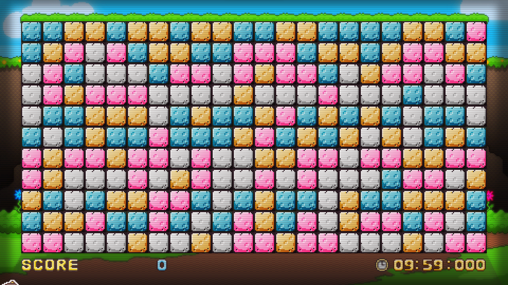

# Foreword

Hello! I'd like to state that not everything in this tool is mine. [Here](https://github.com/Azshene/THM_Solver) is the repo for the solver itself (Azshene/THM_Solver), and [here](https://github.com/artur-ag/TreasureHuntParser) is the repo for the image parser (artur-ag/TreasureHuntParser). My code is `start.py`, along with tweaks to both those scripts.

As the name suggests, `UpdatedMonolithSolver` is a bug-fixed version of Azshene's script. Two years later, I found artur-ag's script and adjusted the code to accommodate it. 

## Contact Info

Should you run into any problems, you are free to contact me. I'm generally very responsive, even almost a decade later. Please refer to the [Afterword](https://github.com/DanLeEpicMan/UpdatedMonolithSolver#afterword).

I've largely forgotten about this project, but occasionally return to it. There is certainly room for improvement if any programmers are willing to carry the torch. Feel free to contact me about technical details.

# Instructions

[Here is a video of me going over the instructions](https://youtu.be/63QQr9axij0). These written instructions are newer, but are largely the same.

## Operating System Compatibility

These instructions assume that you are using a computer with Windows. The scripts should work fine on any operating system, though I haven't tested them.

If you aren't using Windows...

- **Mac**: You should know how to use terminal and change the working directory in order to pass Step 2. You should also know how to take screenshots and save them as a file in order to pass Step 3.1.
- **Linux**: If you're using Linux, then you know what you're doing. The differences in instructions are the same as Mac.

In any event that you run into issues with the script on a different operating system, refer to the instructions of the individual repositories.

## Prerequisites and Installation

In order to run this script, you must have

- Python 3.6 (or newer)
- NumPy
- OpenCV
- Pillow

If you have no clue what any of those mean, [you should start by downloading the latest version of Python](https://www.python.org/downloads/).

Also, don't forget to download the solver itself. Make sure you unzip it somewhere you can easily access (e.g. Downloads).

<small>My original instructions mention installing Anaconda. This is unnecessary, [but you're welcome to if it makes you feel more comfortable](https://www.anaconda.com/download/success?reg=skipped).</small>

## Step 1

Open command prompt by searching `cmd` in the Windows Search bar. Run the following commands

```
pip install numpy
pip install opencv-python
pip install pillow
```

If you receive an error with pip, try this instead.

```
python -m pip install numpy
python -m pip install opencv-python
python -m pip install pillow
```

## Step 2

Change your working directory to the unzipped solver. If this is gibberish to you:

### 2.1

In File Explorer, go into the Monolith folder (the default title is "UpdatedMonolithSolver-main") and copy the directory link. For example, my directory looked like this 
```
C:\Users\Daniel\Downloads\UpdatedMonolithSolver-main
```
### 2.2

In command prompt, type `cd (whatever you just copied)`. For example, I would input this into my command prompt (right click to paste)

```
cd C:\Users\Daniel\Downloads\UpdatedMonolithSolver-main
```

If you left the zip destination unchanged, type `cd UpdatedMonolithSolver-main` again.
	
## Step 3

This step is where you actually start to use the solver. I highly recommend:

1. **Playing the game in Borderless Windowed mode.** (!!!)
   - You will be using `Alt + Tab` a lot.
   - This will also make taking screenshots easier.
2. Muting the game in Volume Mixer
   - Otherwise you'll go insane. 

### 3.1

Start a game and take a picture of the board. Use `Prt Scr` if in Borderless Windowed mode and `Windows Key + Shift + S` otherwise. Then pause the minigame by opening the controls **(F3 on QWERTY layout)**. 

**It is extremely important that**

1. You have a picture of the entire minigame, *not* just the board.
   - Make sure the margins are equally spaced. 
2. The hammer is out of frame, e.g. in the bottom-left corner.
3. **Nothing beyond the minigame is visible in your screenshot.** (!!!)
   - No taskbar, no menu bar. Just Danganronpa V3.

Here's a sample screenshot



`Prt Scr` in Borderless Windowed mode is the easiest way to recreate this screenshot.

### 3.2

Save your screenshot as a PNG file. JPG works too. Name it something you can easily remember.

If you don't know how, here's a quick-and-dirty way

- Open Microsoft Paint
  - Search "Paint" in the Windows Search Bar
- Paste with `Ctrl + V`
- File → Save As → PNG
- Make sure you only save the image and not any extra background white space.

### 3.3

<small>**If the image parser fails during this step, then refer to [manually making the board](https://github.com/DanLeEpicMan/UpdatedMonolithSolver#manually-making-the-board). It includes alternate instructions.**</small>

Once that is all saved, go back to command prompt and type the following command

```
python start.py boardName
```

Replace "boardName" with whatever you named your screenshot. For example, if I wanted to run the script on the included sample board, I would input

```
python start.py testBoard
```

**If you saved your image as a JPG, include .jpg with the board name.**

## Step 4

Once the program is done, it should open a file explorer window with images titled "step". Follow those steps in order, starting from 0. 

There is a small yellow box around the block you should click.

## Step 5

If you have to restart after clearing the entire board, then go to [Step 3](https://github.com/DanLeEpicMan/UpdatedMonolithSolver#step-3). 

If you have to reopen command prompt again, then go to [Step 2](https://github.com/DanLeEpicMan/UpdatedMonolithSolver#step-2) instead.

# Useful Tips

None of the following tips are necessary to use the solver. However, they'll boost its effectiveness.

## Accounting for Treasure

**This program does NOT account for your treasure!** As soon as you see treasure, stop following the solver and do everything you can to uncover it, since this solver may not obtain it in the end. (Especially if it's a Monokub.)

After you get your treasure, you can take another screenshot of the board and return to [Step 3](https://github.com/DanLeEpicMan/UpdatedMonolithSolver#step-3). 

Double-check the solution it gives you, especially in areas with uncovered treasure. Refer to [manually making the board](https://github.com/DanLeEpicMan/UpdatedMonolithSolver#manually-making-the-board).

## Manually Making the Board

Sometimes the parser may fail and generate an incorrect board. This shouldn't happen very often, but is nonetheless possible. If this is your case, go to the 'boards' folder and edit the file called `out`. Refer to the following images for correctly making a board:

This is the board I have


  
And this is how I would recreate it

```
4,4,3,3,4,3,3,4,3,3,4,4,3,3,4,4,4,4,3,3,4,2
4,3,2,1,2,4,3,3,4,4,2,2,2,4,3,3,4,3,2,2,3,3
1,2,4,1,1,1,4,2,2,1,2,3,2,2,4,1,3,2,2,1,2,4
1,2,3,2,2,2,1,1,1,1,3,1,1,1,2,1,1,1,4,1,1,1
1,4,4,3,3,3,1,4,3,4,4,3,2,4,3,4,3,4,1,4,4,1
4,1,4,3,4,4,2,4,4,4,3,2,4,3,4,3,1,3,1,4,3,4
2,3,2,2,3,2,2,1,2,1,1,3,3,2,2,1,2,2,3,3,2,2
2,3,1,1,1,2,1,3,2,1,1,2,1,2,1,1,1,4,2,2,1,3
3,4,1,4,3,3,2,2,4,1,4,3,4,4,1,3,4,4,3,3,3,4
4,3,3,2,4,4,2,4,1,4,2,3,4,2,1,3,2,2,4,2,1,4
2,2,1,1,1,3,1,1,3,1,2,2,3,2,2,1,1,1,3,1,2,2
```

**Note that 1=Gray, 2=Pink, 3=Orange, 4=Blue. Use 0 for open blocks.**

Since the start.py script only takes images as input, you won't be able to use it. To get around this, use the following command

```
python THM.py out
```

Feel free to shoot me a message if you're having trouble (see [Afterword](https://github.com/DanLeEpicMan/UpdatedMonolithSolver#afterword)).

Manually making the board is an incredibly tedious process. If you have to do it from scratch consistently, then I recommend trying out [this](https://github.com/westpipe/treasurefinder) alternate solver (westpipe/treasurefinder).

## Incomplete Solution

Very rarely, the program may generate an incomplete solution. By default, the program terminates once it has checked 5000 board states. If you ever run into this problem, use the following command

```
python THM.py out 100 7500
```

That command will let the program check 7500 boards instead of 5000, increasing the likelihood of finding a more complete solution. It might take a few seconds longer though.

# Afterword

I hope my explanation was as informative as it could be! The two repositories I borrowed from had their own instructions, but I felt like I should write my own to help streamline everything. Remember that this tool won't guarantee success immediately, and you will most likely have to retry this a few times.

If you run into any issues (or just wanna have a chat), then please feel free to shoot me a message. **My Discord is _danleman1337_. Alternatively, you can add my [Steam account](https://steamcommunity.com/id/danleepicman/) if you prefer to use that instead** (in case the link doesn't work, my friend code is 442227082).

Full credit to both authors I borrowed code from! Feel free to also modify and redistribute this as you wish. Released under MIT License.
